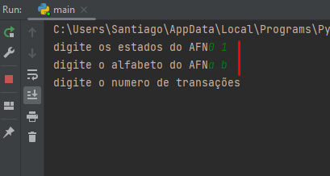
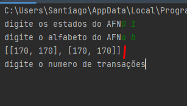
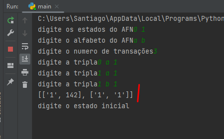

# Formal Languages and Automata
[](https://www.python.org/downloads/release/python-360/)

***
> Gustavo Santiago Sousa <br>
> Bachelor of Exact and Technological Sciences - UFRB <br>
> Graduating in Computer Engineering - UFRB <br>

- [Getting Started](#Getting_Started)
  - [requisites](#requisites)
  - [Running the application](#Running_the_application) 
- [About The Project](#aboutProject)
  - [States and Alfabeth](#States_and_Alfabeth)
  - [Matrix](#matrix)
  - [Feeding matrix](#feeding_matrix)
  - [Final definitions](#final_definitions)
  - [Word analysis](#word_analysis)
  - [Final Considerations](#final_considerations)
***
## <a id="Getting_Started" />Getting Started
### <a id="requisites" />Requisites
- [Python 3.6](https://www.python.org/downloads/release/python-360/)
### <a id="Running_the_application" />Running the application

```sh
python main.py
```
<a id="aboutProject" />About The Project
- 
The System basically consists of a configurable deterministic finite automaton (AFD) . Where the user can configure the amount of states and the alphabet that that automaton will support. Next, the user defines the number of instructions he wants to define for the automaton. Each instruction is a triple defined as follows: "state action/letter future state". After this "training" the initial state and the final state are defined. And then the AFD is ready to receive a word and return S if the word belongs to the alphabet and N if it does not.

***
## <a id="States_and_Alfabeth" />States and Alfabeth

User informs AFD states separated by space* and in the sequence it informs the symbols that the alphabet will contain
ex:



then a random number different from the other states already defined by the user is created to represent the standard error state. (Can have more than one error state without problems)
```sh
stateOfError = randint(0, len(states) * 100)
while (stateOfError in states): stateOfError = randint(0, len(states) * 100)
```

*note: states were defined as integers to facilitate future operations and to generate the default error state.
## <a id="matrix" />Matrix
Thinking about the representation of an AFD, it was decided to create a state/action table. Where for each state there are actions available (letters of the alphabet in this case) and these actions indicate future states if that action is chosen for that state.

As the user may not complete all transitions, that is, inform where each state goes depending on which action and current state. We will assume that every uninformed transition will result in an error state. So first we create the whole matrix with error states

``` sh
def gerar_matriz(n_linhas, n_colunas):
    return [[stateOfError] * n_colunas for _ in range(n_linhas)]

matriz = gerar_matriz(len(states), len(alfabeth))  # criando a matriz estado/ações
```


Something like that:



notice that the matrix became 2x2 due to having 2 states and 2 actions. and that any transition in it leads to an error state

***
## <a id="Feeding_matrix" />Feeding Matrix
Now, with a matrix with all values being the error state, we can fill it with the instructions that the user types and this way we will have an AFD that behaves exactly as the user instructions define and with an error state for all others. that not;
``` sh
trasaction = int(input('digite o numero de transações'))  # pegando o numero de transações

for i in range(trasaction):
    tripla = input('digite a tripla').split(' ');  # pegando a tripla
    stateFrom = tripla[0];
    letra = tripla[1];
    stateTo = tripla[2];
    if (stateFrom or stateTo) not in states: raise Exception("estado invalido")
    if letra not in alfabeth: raise Exception("letra invalida");

    matriz[states.index(stateFrom)][alfabeth.index(letra)] = stateTo;  # populando a matriz com os estados

```
After extracting the information from the tuple of the current state, letter and future state, we check if the states belong to those defined at the beginning of the program and if the letter belongs to the alphabet

Here's a little note, our letters are not numbers, so we can't use them as indexes in the matrix, so instead we'll look for the index of the alphabet vector that contains that symbol and we'll use that index as the index in the matrix, the same for the states because it is possible for the user to define only two states as 7 and 8 when trying to access position 7 of the matrix would cause an error.

Then we will work with the indices of the elements in the vectors of states and alphabets

At the end you should have something like this:



So in line 0 (state 0) column 0 (a) the future state is 1. But in line 0 (state 0) column 1 (b) which has not been defined by the user indicates that the AFD will go to an error state
***
## <a id="final_definitions" />Final Definitions

This part defines the initial and final states. Which will be used in the word analysis part

``` sh
initialState = input();
finalState = input().split(" ");
```
***
## <a id="word_analysis" />Word Analysis

A primeira parte na analise se uma palavra é aceita pelo AFD é a obtenção delas e a analise individual. Para isso o estadoAtual passa a ser o estado inicial. Então será feito uma analise para letra da palavra. 


``` sh
words = input('digite as palavras do sistema').split(' ')

for word in words:
    atualState = initialState;
    for y in word:
        if(atualState != stateOfError):
            atualState = matriz[states.index(atualState)][alfabeth.index(y)];  # pegando o estado futuro na matriz de estado/ações
    if (atualState in finalState):
        print('S')
    else:
        print('N')
```
If the current state is different from the error state, the current state will be equal to the matrix value
in the line with index equal to the currentstate index in the state array
and column with index equal to the index of the current letter of the analyzed word in the alphabet array

At the end, if the current state is present in the final states, AFD produces output 'S' if not output 'N'

As the operations on the matrix occur directly through the indexes, they are computationally cheaper. The computationally most expensive part would be getting the index of the elements in the alphabet and states arrays, which would have o(n) order


## <a id="final_considerations" />Final Considerations

Some modifications needed to be made since the run codes (program that evaluates the code with inputs and outputs) confused the input message with an output produced from the system, so these explanatory messages were removed from the input. In addition, the possibility of the existence of more than one final state was noted, so the final state became a array and at the end, instead of comparing the current state with the final state, it only checks if the current state is present in the final state. final states array