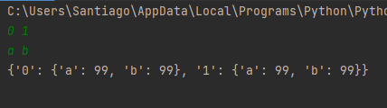
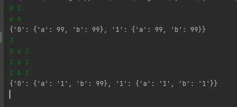

# Formal Languages and Automata
[](https://www.python.org/downloads/release/python-360/)

***
> Gustavo Santiago Sousa <br>
> Bachelor of Exact and Technological Sciences - UFRB <br>
> Graduating in Computer Engineering - UFRB <br>

- [Getting Started](#Getting_Started)
  - [requisites](#requisites)
  - [Running the application](#Running_the_application) 
- [About The Project](#aboutProject)
  - [States and Alfabeth](#States_and_Alfabeth)
  - [Dictionary](#dictionary)
  - [Feeding dictionary](#feeding_dictionary)
  - [Final definitions](#final_definitions)
  - [Word analysis](#word_analysis)
***
## <a id="Getting_Started" />Getting Started
### <a id="requisites" />Requisites
- [Python 3.6](https://www.python.org/downloads/release/python-360/)
### <a id="Running_the_application" />Running the application

```sh
python main.py
```
<a id="aboutProject" />About The Project
- 
The System basically consists of a configurable deterministic finite automaton (AFD) . Where the user can configure the amount of states and the alphabet that that automaton will support. Next, the user defines the number of instructions he wants to define for the automaton. Each instruction is a triple defined as follows: "state action/letter future state". After this "training" the initial state and the final state are defined. And then the AFD is ready to receive a word and return S if the word belongs to the alphabet and N if it does not.

***
## <a id="States_and_Alfabeth" />States and Alfabeth

User informs AFD states separated by space* and in the sequence it informs the symbols that the alphabet will contain
ex:


then a random number different from the other states already defined by the user is created to represent the standard error state. (Can have more than one error state without problems)
```sh
stateOfError = randint(0, len(states) * 100)
while (stateOfError in states): stateOfError = randint(0, len(states) * 100)
```

## <a id="dictionary" />Dictionary
Thinking about the representation of an AFD, it was decided to create a state/action dictionary. Where for each state there are actions available (letters of the alphabet in this case) and these actions indicate future states if that action is chosen for that state.

As the user may not complete all transitions, that is, inform where each state goes depending on which action and current state. We will assume that every uninformed transition will result in an error state. So first we create the entire dictionary with all actions from all states leading to the error state.

``` sh
dicionarioDeEstadosFuturos = {};

for i in states:
    dicionarioDeEstadosFuturos[i] = {}
    for j in alfabeth:
        dicionarioDeEstadosFuturos[i][j] = stateOfError;
```


Something like that:


where '99' was the random error state chosen by the system

***
## <a id="Feeding_dictionary" />Feeding Dictionary
Now, with a dictionary with all values being the error state, we can fill it with the instructions that the user types and this way we will have an AFD that behaves exactly as the user instructions define and with an error state for all others that not;
``` sh
trasaction = int(input('digite o numero de transações'))  # pegando o numero de transações

for i in range(trasaction):
    tripla = input().split(" ");  # pegando a tripla
    stateFrom = tripla[0];
    letra = tripla[1];
    stateTo = tripla[2];
    dicionarioDeEstadosFuturos[stateFrom][letra] = stateTo;  # populando o dicionario com os estados futuros corretos

```

At the end you should have something like this:


So in line 0 (state 0) column 0 (a) the future state is 1. But in line 0 (state 0) column 1 (b) which has not been defined by the user indicates that the AFD will go to an error state
***
## <a id="final_definitions" />Final Definitions

This part defines the initial and final states or final states (may have more than one). Which will be used in the word analysis part
``` sh
initialState = input();
finalState = input().split(" ");
```
***
## <a id="word_analysis" />Word Analysis

The first part in analyzing whether a word is accepted by the AFD is obtaining them and analyzing them individually. For this, the CurrentState becomes the initial state. Then an analysis will be made for each letter of the word.

``` sh
words = input().split(" ")

for word in words:
    atualState = initialState;
    for y in word:
        if(atualState != stateOfError):
            atualState = dicionarioDeEstadosFuturos[atualState][y];  # pegando o estado futuro no dicionario de estado/ações
    if (atualState in finalState):
        print('S')
    else:
        print('N')
```
If the current state is different from the error state, the current state will be equal to the dictionary value in propery 'atualState' and propery 'letter'

At the end, if the current state is present in the final states, AFD produces output 'S' if not output 'N'

As the operations on the dictionary occur directly through the keys, they are computationally cheaper which would have o(n) order