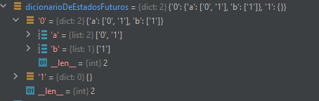

# Formal Languages and Automata
[](https://www.python.org/downloads/release/python-360/)

***
> Gustavo Santiago Sousa <br>
> Bachelor of Exact and Technological Sciences - UFRB <br>
> Graduating in Computer Engineering - UFRB <br>

- [Getting Started](#Getting_Started)
  - [requisites](#requisites)
  - [Running the application](#Running_the_application) 
- [About The Project](#aboutProject)
  - [States and Alfabeth](#States_and_Alfabeth)
  - [Dictionary](#dictionary)
  - [Feeding dictionary](#feeding_dictionary)
  - [Final definitions](#final_definitions)
  - [Word analysis](#word_analysis)
***
## <a id="Getting_Started" />Getting Started
### <a id="requisites" />Requisites
- [Python 3.6](https://www.python.org/downloads/release/python-360/)
### <a id="Running_the_application" />Running the application

```sh
python main.py
```
<a id="aboutProject" />About The Project
- 
The System basically consists of a configurable not deterministic finite automaton (AFND) . Where the user can configure the amount of states and the alphabet that that automaton will support. Next, the user defines the number of instructions he wants to define for the automaton. Each instruction is a triple defined as follows: "state action/letter future state". After this "training" the initial state and the finals states are defined. And then the AFND is ready to receive a word and return S if the word belongs to the alphabet and N if it does not.

***
## <a id="States_and_Alfabeth" />States and Alfabeth

User informs AFND states separated by space* and in the sequence it informs the symbols that the alphabet will contain
``` sh
distates = input().split(" ");  # pegando os estados
alfabeth = input().split(" ")  # pegando o alfabeto

trasaction = int(input())  # pegando o numero de transações
```

## <a id="dictionary" />Dictionary
Thinking about the representation of an AFND, it was decided to create a state/action dictionary. Where for each state there are actions available (letters of the alphabet in this case) and these actions indicate a set of future states if that action is chosen for that state.
``` sh
for i in range(0, trasaction):
    tripla = input().split(" ");  # pegando a tripla
    stateFrom = tripla[0];
    letra = tripla[1];
    stateTo = tripla[2];

    if(letra in dicionarioDeEstadosFuturos[stateFrom]): #adiciona um estado a lista de estados futuros 
        dicionarioDeEstadosFuturos[stateFrom][letra].append(stateTo)
    else: #ou cria a lista caso essa ainda não exista
        dicionarioDeEstadosFuturos[stateFrom][letra] = [stateTo]

```

Something like that:


***
## <a id="final_definitions" />Final Definitions

This part defines the initial and final states or final states (may have more than one). Which will be used in the word analysis part
``` sh
initialState = input();
finalState = input().split(" ");
```
***
## <a id="word_analysis" />Word Analysis

The first part of analyzing whether a word is accepted by the AFND is to obtain and analyze them individually. For this, a list with the current states is created

With each word read, the list of initial states becomes a list containing only the initial state. Then, for each letter of the word a new list is created, this will contain the future states. Then, for each state in the list of current states, the dictionary is searched for the current state and the current letter and if there is a vector corresponding to these two keys in the dictionary it is added to the list of future states.

When there are no more current states. all future states accumulated while processing the current states are added to the list of current states. Then the process repeats, now with a new current letter and other current states

When there are no more letters in the word, it is analyzed if among the list of current states, any are final, and if so, that word is classified as valid, returning 'S' or if there is no final state among the current states, the program returns 'N'
``` sh
words = input().split(" ")

for word in words:
    stack_of_atualStates = [initialState]
    for letter in word:
        stack_of_futureStates = []
        for state in stack_of_atualStates:
            if(dicionarioDeEstadosFuturos[state].get(letter)):
                futureStates = dicionarioDeEstadosFuturos[state].get(letter)
                for futureState in futureStates:
                    if(futureState not in stack_of_futureStates):
                        stack_of_futureStates.append(futureState)
        stack_of_atualStates = stack_of_futureStates
    
    flag = 0
    for state in stack_of_atualStates:
        if(state in finalStates):
            flag = 1
    if(flag):
        print('S')
    else:
        print('N')
```